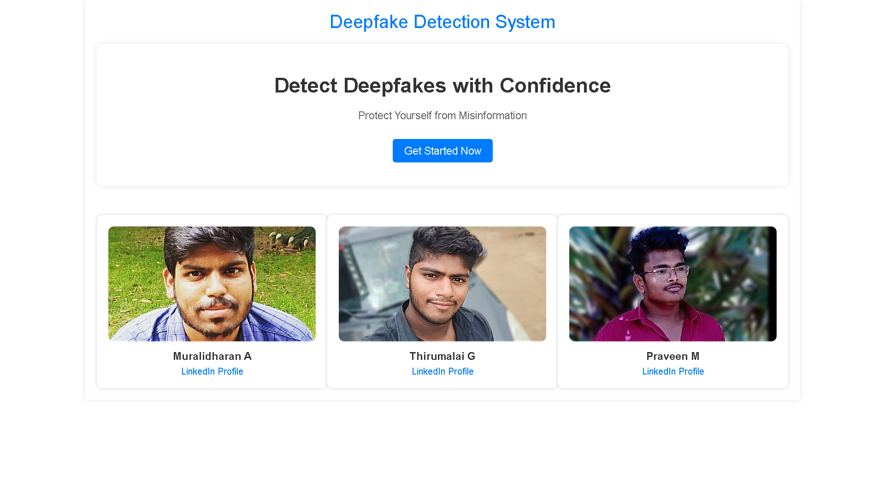
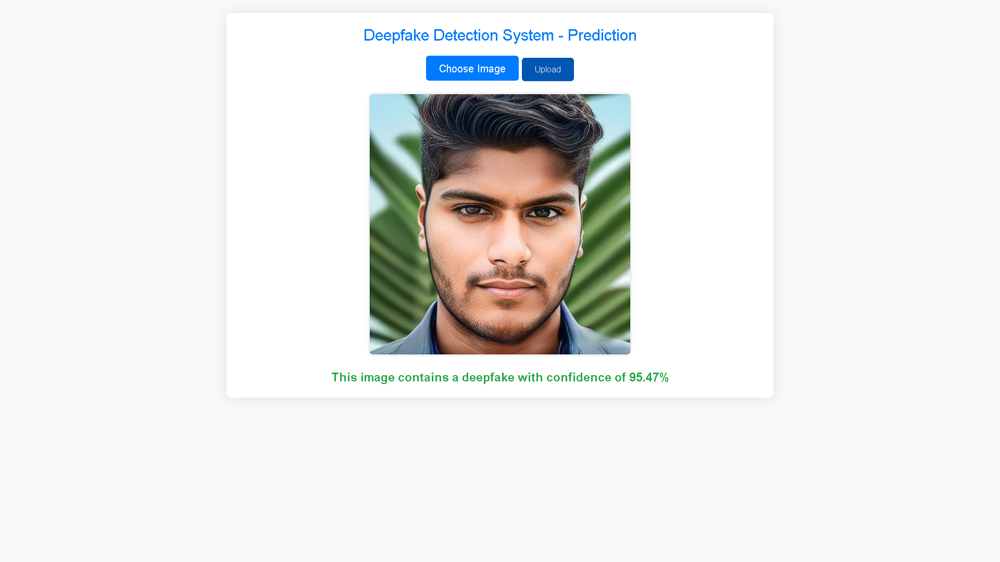

# Deepfake Detection

This repository contains the code and resources for a deepfake detection system. The system uses a neural network trained on a dataset generated from Metalabs videos and provides a web interface for users to interact with the model. This project won 3rd prize in the SRMIST Ideathon 2024 held at SRM University, Kattankulathur, Chennai.

## Features

- **Neural Network Training**: The model is trained on a dataset of deepfake and real videos, generated from Metalabs videos.
- **Web Interface**: A user-friendly web interface built with Flask to upload and analyze videos.
- **Accurate Detection**: High accuracy in distinguishing between deepfake and real videos.
- **Award-Winning**: Secured 3rd prize in the SRMIST Ideathon 2024.

## Snapshots

### Home Page


### Detection Result


## Table of Contents

1. [Installation](#installation)
2. [Usage](#usage)
3. [Dataset](#dataset)
4. [Model](#model)
5. [Web Interface](#web-interface)
6. [Contributing](#contributing)
7. [License](#license)

## Installation

1. Clone the repository:
    ```sh
    git clone https://github.com/Thirupy/Deepfake-Detection-Won-in-SRM-ideathon.git
    cd Deepfake-Detection-Won-in-SRM-ideathon
    ```

2. Create a virtual environment:
    ```sh
    python -m venv venv
    source venv/bin/activate  # On Windows use `venv\Scripts\activate`
    ```

3. Install the required dependencies:
    ```sh
    pip install -r requirements.txt
    ```

## Usage

1. **Running the Web Interface**:
    - Start the Flask server:
      ```sh
      python app.py
      ```
    - Open your browser and go to `http://127.0.0.1:5000` to access the web interface.

## Dataset

The dataset used for training is generated from Metalabs videos. It consists of both deepfake and real videos, carefully curated and labeled for effective training. Due to privacy and licensing constraints, the dataset is not included in this repository. Please contact us for more information on how to obtain the dataset.

## Model

The model is a neural network designed to classify images as deepfake or real. You can Download Trained Model [here](https://drive.google.com/drive/folders/1UNiuP993IBbD1ueloVGRiLCdpySCqyg8?usp=drive_link)
Note:Create a separate folder 'model' to use it

## Web Interface

The web interface is built using Flask and allows users to upload videos and receive a deepfake detection result. The interface is designed to be intuitive and easy to use. 

## Contributing

We welcome contributions to improve the deepfake detection system. If you would like to contribute, please fork the repository and submit a pull request. Ensure your code follows the repository's coding standards and include appropriate tests.

## License

This project is licensed under the MIT License. See the [LICENSE](LICENSE) file for details.

## Contact

For any inquiries or support, please contact me in [Mail](thirumalaioppo@gmail.com).

---

We hope this project contributes to the fight against the misuse of deepfake technology. Thank you for your interest and support!
